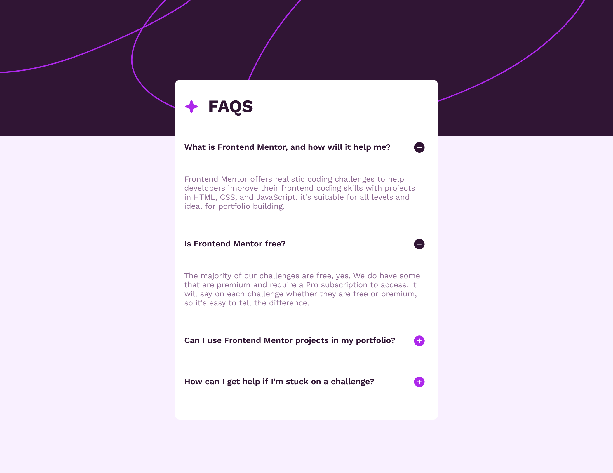

# Frontend Mentor - FAQ accordion solution

This is my solution to the [FAQ accordion challenge on Frontend Mentor](https://www.frontendmentor.io/challenges/faq-accordion-wyfFdeBwBz). Frontend Mentor challenges help you improve your coding skills by building realistic projects. 

##Overview

##Links

### Links

- Solution URL: [Click to view Solution](https://www.frontendmentor.io/solutions/faq-accordion-xsEDHGWF7x)
- Live Site URL: [Click to view Live Site](https://coded-by-mj.github.io/Front-end-Mentor-Challenge2/)

## My process

### Built with
- Semantic HTML5 markup
- CSS custom properties
- Flexbox
- CSS Grid
- JavaScript
- Mobile-first workflow

## Author

- Frontend Mentor - [@Coded-by-MJ](https://www.frontendmentor.io/profile/Coded-by-MJ)
- Twitter - [@Coded-by-MJ](https://twitter.com/Coded_by_MJ)
